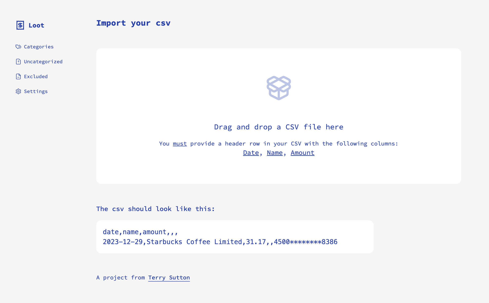

This is a [Next.js](https://nextjs.org/) project bootstrapped with [`create-next-app`](https://github.com/vercel/next.js/tree/canary/packages/create-next-app).

## What is Loot?

Loot is a way to explore your expenses and see where your money goes. How much do you spend on coffees? Lunches out? Sushi? Travel? Kids? Loot can help you find out.

## How do I use it?

Loot is a Next.js app. It's meant to be installed locally. Follow the installation instructions to get up and running.

## Installation

1. clone the repo
2. `npm i` to install dependencies
3. create a `prisma/dev.db` file for your SQLite database
4. get a Prisma client going `npx prisma generate`
5. run the prisma migrations `npx prisma migrate dev`
6. run `npm run dev` to start the server
7. fire up `http://localhost:3102/` to get started!
